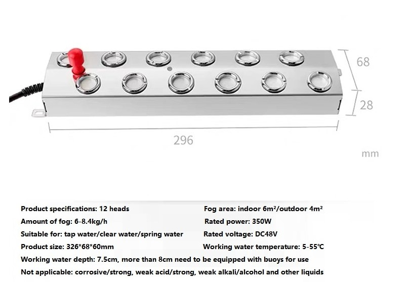
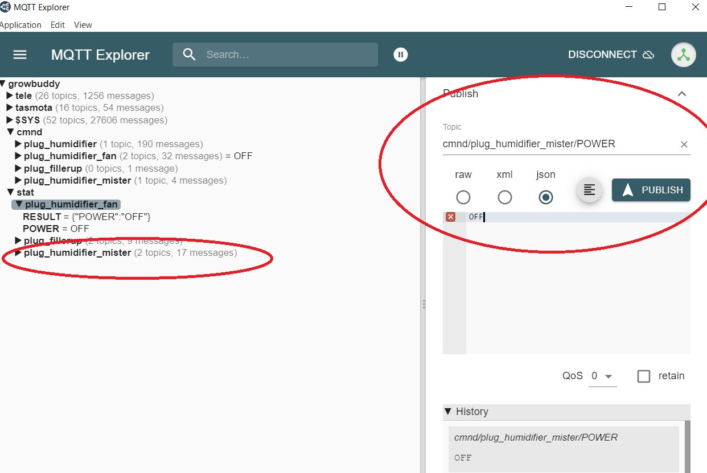
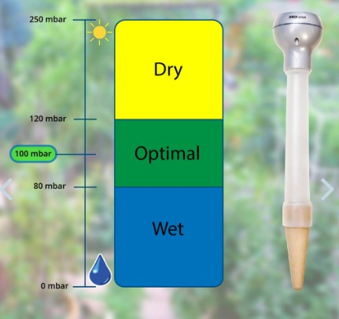

# Sources
- [YouTube video that I found best explained water vapor, temperature's relationship to Relative Humidity and VPD](https://www.youtube.com/watch?v=-bYPGr1TJQY&t=1s).  
# Evolving Grow Tent Automation
My indoor plants are a huge source of joy during the dark and rainy winter months.  That is why I continually evolve my grow tent automation.  If I don't automate some of the indoor grow tasks, I become chained to my grow.  I can't go on vacation because the plants need watering...it's hard dialing in the temperature and humidity...As the grows go by, I learn. Automation has meant healthier plants that produce more yield. Automation means I can enjoy the plants and spend more time looking for diseases or pests.  __My current obsession is optimizing my plant's water needs, both in the form of water vapor as well as irrigation__ .  I am not building a generic solution because I don't need one.  My indoor grow:
- is in my kitchen in the same climate controlled environment I live in.  The temperature is typically around 70℉ and the humidity runs around 50%.  With the LEDs on, the temperature is a few degrees higher.  Given an above day temperature of 70 ℉ or above, I will only adjust humidity.  Since the humidity is moderately low, I will use a humidifier but not a dehumidifier.
- luxuriates in a bed of living soil.  Perhaps unusual to have a bed of soil in a kitchen, but I can't stop thinking about happy microbes.

Because the indoor climate control is close to ideal except the humidity is low, automating VPD to the ideal value will mean turning a DIY humidifier on and off.  

# VPD Buddy System Overview
__VPD Buddy__ adjusts the humidity to ideal VPD ranges for the given growth stage the plants are in.

VPD Buddy includes:
## SnifferBuddy

[SnifferBuddy](https://github.com/solarslurpi/GrowBuddy/blob/main/pages/SNIFFER_BUDDY.md) takes CO2 level, temperature, and humidity readings.  I will use the same SnifferBuddy I used last time.  It sends an mqtt message `tele/snifferbuddy/SENSOR` handled by the `growbuddy` broker with the payload `{"Time":"2022-09-06T08:52:59","ANALOG":{"A0":542},"SCD30":{"CarbonDioxide":814,"eCO2":787,"Temperature":71.8,"Humidity":61.6,"DewPoint":57.9},"TempUnit":"F"}` every twenty seconds. 

   
[MQTT Explorer](http://mqtt-explorer.com/) showing snifferbuddy messages.
    
_Note: I've been using a scd30 (or scd40) because these sensors have awesome CO2 detection._

I let VPD Buddy know what stage the plants are at - baby, vegetative (veg), or flower.

_Note: I enter the growth stage - either Baby, Vegetative, or Flower._

The VPD Controller reads in the setpoint values for the VPD given the growth stage the plants are in. The source for the ideal VPD values is Pulse's [_The Ultimate Vapor Pressure Deficit (VPD) Guide_](https://pulsegrow.com/blogs/learn/vpd).  I take the average value of the range and use that as the setpoint value.

## VPD Manager
__VPD Manager__ manages the amount of Water Vapor:
    - Subscribes to the SnifferBuddy (mqtt) messages to get the environment's temperature and humidity.
    - Uses a PID controller to return the number of seconds the humidifier should be turned on to get to the setpoint.  _Note: I wish I had folks who could evaluate this code.  This is my first PID controller.  
    - Sets up a callback that returns the date and time a reading was taken, the CO2 level, air temperature, RH (Relative Humidity), and VPD.
## Humidifier
I couldn't find a humidifier that I could easily automate refilling the tank as well as providing strong enough water vapor to fill the grow tent.  So I made one.
### BoM
- [Storage Tote from Home Depot](https://www.homedepot.com/p/HDX-14-Gal-Tough-Storage-Tote-in-Black-with-Yellow-Lid-SW111/314468098).
- [2 in. PVC Pipe from Home Depot](https://www.homedepot.com/p/JM-EAGLE-2-in-x-10-ft-White-PVC-Schedule-40-DWV-Plain-End-Pipe-531137/100161954).
- [2 in. PVC 90° elbow](https://www.homedepot.com/p/Charlotte-Pipe-2-in-PVC-DWV-90-Degree-Hub-x-Hub-Elbow-PVC003001000HD/203393418).
- [Mist maker from Aliexpress](https://www.aliexpress.com/item/3256803543458943.html?spm=a2g0o.order_list.0.0.57dd1802LzMQr6).  After trying out the one I got, I could imagine getting one half the strength.  Someday I'll figure out how to do the back of the envelope calculations to get exactly what I need...but for now I do what I alwasy do, I bumble on!

The one I got specifies a 48VDC power source rated at 350W.  Looking at Power(P) = Voltage(V)*Current(I), I'm interested in how much current is needed. I = 350W/48VDC = 7.3 Amps.  Which is a significant amount!  I had a 48V 250W power supply that I am using which works.  In fact, it is overkill for my space!
- Fan from a PC.  We have an electronics parts store near me that has a box full of PC fans.  The one I am using is quite strong, running at 24V.
- Two Sonoff S31 plugs that have been [Tasmotized](https://github.com/solarslurpi/GrowBuddy/blob/main/pages/flashing_SONOFF_S31.md). I bought a [pack of four from Amazon](https://amzn.to/3xnPWYc).

The VPD controller sends an mqtt message to both the tasmotized Sonos plug that the humidifier's fan is plugged into as well the Sonos plug that the humidifier's misters is plugged into. 

The above images used MQTT explorer to test sending an ON and OFF message to the plug_humidifier_mister topic on the growbuddy broker.

## VPD Buddy
At this point, __VPD Buddy__ is Python code that ties everything together.  Over time, this could expand into a User Interface.  

# Goals
- Collect data for historical use.  Not for adjustments.  The VPD is "set and forget". 

# Managing Irrigation
Another thing to dial in is irrigation.  My strategy is to use Blumats.  

I used Blumats in my previous yield.  It makes sense to me that being able to measure the water tension around the ceramic is a superb way of dialing in soil moisture.  But Blumats require a level of expertise I am still acquiring. A challenge was knowing if the ceramic carrots were correctly placed in the soil.  It is too easy to accidentally bump a carrot, or place it where there is a stone that lets air in between the ceramic and the soil.  The biggest challenge I have is with the [moisture sensor](https://www.sustainablevillage.com/blumat-digital-moisture-meter?quantity=1).  Challenges:
- it is not hooked up to the wifi.  This means to get a ready, I have to go to the device and "disturb" it.
- by "disturb" I mean I have to push a button and then try to read poorly lit LED digits.  This is made a bigger challenge due to my less than ideal eyesight.
- This disturbance has knocked the sensor enough such that the ceramic no longer has the connection to the soil.  When this happens, the readings do not reflect the soil.  This happened more than I would like.  So I compromised.

## Water Valve Control
I will continue to use the carrots for water valve control.
## Validating the soil moisture
In the discussion above, I noted how I had been using Blumat's soil moisture tensiometer and the challenges I had in it's use.  This time, I will try setting up the soil moisture for the carrots with the Blumat soil moisture sensor.  Then use a simple capacitative touch sensor with wifi to monitor that the carrots are opening and closing the water valves correctly.

