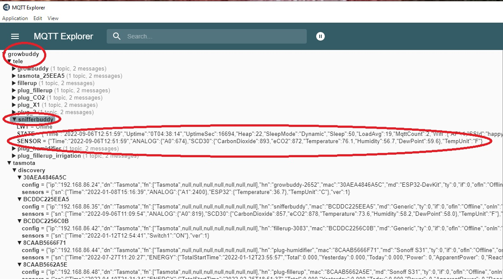

# Sources
- [YouTube video that I found best explained water vapor, temperature's relationship to Relative Humidity, and VPD](https://www.youtube.com/watch?v=-bYPGr1TJQY&t=1s).  The concept of VPD
# Welcome
My indoor plants are a huge source of joy during the dark and rainy winter months.  That is why I continually evolve my grow room automation.  If I don't automate some of the indoor grow tasks, I become chained to my grow.  I can't go on vacation because the plants need watering...it's hard dialing in the temperature and humidity...As the grows go by, I learn. Automation has meant healthier plants that produce more yield. Automation means I can enjoy the plants and spend more time looking for diseases or pests.  __My current obsession is optimizing my plant's water needs, both in the form of water vapor as well as irrigation__ .  I am not building a generic solution because I don't need one.  My indoor grow:
- is in my kitchen in the same climate controlled environment I live in.  The temperature is typically around 70℉ and the humidity runs around 50%.  With the LEDs on, the grow tent environment is a few degrees higher.  Given an above day temperature of 70 ℉ or above, I will only adjust humidity.  Since the humidity is moderately low, I will use a humidifier but not a dehumidifier.
- luxuriates in a bed of living soil.  Perhaps unusual to have a bed of soil in a kitchen, but I can't stop thinking about happy microbes.

Because the indoor climate control is close to ideal except the humidity is low, automating VPD to the ideal value will mean turning a DIY humidifier on and off.  I am using a DIY himidifier because I couldn't find one that was easy to automatically refill and didn't have the fitting I wanted.

# VPD Buddy System Overview
__VPD Buddy__ adjusts the humidity to ideal VPD ranges for the given growth stage the plants are in.

VPD Buddy includes:
## SnifferBuddy

[SnifferBuddy](https://github.com/solarslurpi/GrowBuddy/blob/main/pages/SNIFFER_BUDDY.md) takes CO2 level, temperature, and humidity readings.  I will use the same SnifferBuddy I used last time.  It sends an mqtt message `tele/snifferbuddy/SENSOR` handled by the `growbuddy` broker with the payload `{"Time":"2022-09-06T08:52:59","ANALOG":{"A0":542},"SCD30":{"CarbonDioxide":814,"eCO2":787,"Temperature":71.8,"Humidity":61.6,"DewPoint":57.9},"TempUnit":"F"}` every twenty seconds. 

    
            [MQTT Explorer](http://mqtt-explorer.com/) showing snifferbuddy messages.
    
_Note: I've been using a scd30 (or scd40) because these sensors have awesome CO2 detection._

I let VPD Buddy know what stage the plants are at - baby, vegetative (veg), or flower.

_Note: I enter the growth stage - either Baby, Vegetative, or Flower._

The VPD Controller reads in the setpoint values for the VPD given the growth stage the plants are in. The source for the ideal VPD values is Pulse's [_The Ultimate Vapor Pressure Deficit (VPD) Guide_](https://pulsegrow.com/blogs/learn/vpd).  I take the average value of the range and use that as the setpoint value.

## VPD Manager
- __VPD Manager__ for Managing the Amount of Water Vapor:
    - Subscribes to the SnifferBuddy (mqtt) messages to get the environment's temperature and humidity.
    - Uses a PID controller to return the number of seconds the humidifier should be turned on to get to the setpoint.  
    - Sets up a callback that returns the date and time a reading was taken, the CO2 level, air temperature, RH (Relative Humidity), and VPD
## VPD Buddy

# Goals
- Collect data for historical use.  Not for adjustments.  The VPD is "set and forget". 

# VPD Buddy

# TODO

# Managing Irrigation
Another thing to dial in is irrigation.  My strategy is to use Blumats.  To dial in the opening/closing of the Blumat valve, the soil the Blumat system will irrigate needs to be at the ideal wetness.  To do that, I'll calibrate some wifi enabled soil moisture sensors